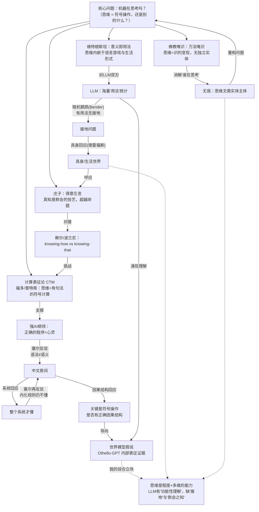

# 什么是"思维"？——机器在思考吗

> **这是一篇"旗舰范本"。** 它不属于"按学派/按专题"陈述知识的旧体例，而属于一种新体例：**问题驱动的横切探究**。
> 它要示范的不是"知道某位哲学家说了什么"，而是**亲自把一个真问题想到底**：重构论证、构造最强反驳、给出回应、敢于站队、并诚实标注悬而未决之处。
>
> 写作三原则（也是全库后续升级的标准）：
> 1. **深度思考**：每个核心论证走"五段式"——① 论证重构 ② 最强反驳（steel-man）③ 回应 ④ 我的立场 ⑤ 悬而未决。
> 2. **综合应用（横切）**：一个问题同时调动西方、东方、逻辑学与你的真实研究，而不是把"现代关联"当脚注。
> 3. **落地**：最终产出一个可操作的工具（这里是"LLM 思维的哲学审计表"和一个可执行的研究设计）。

**相关旧文件**（陈述式综述，作为本文的"弹药库"）：[心灵哲学](../专题/02-心灵哲学.md) · [逻辑学与语言哲学](../专题/06-逻辑学与语言哲学.md) · [佛学](../东方哲学/03-佛学.md) · [道家哲学](../东方哲学/02-道家哲学.md) · [印度哲学](../东方哲学/04-印度哲学.md) · [哲学与AI研究的交叉](../专题/11-哲学与AI研究的交叉.md) · [科学研究方法论](../专题/08-哲学与科学研究方法论.md)

---

## 0. 为什么从"思维"而不是"意识"切入

[心灵哲学](../专题/02-心灵哲学.md)把火力集中在**意识**（困难问题、感质、僵尸）。但对 AI 研究者，更近身、更可操作的问题其实是**思维**：

- "意识"问"为什么有主观体验"——这是形而上学的硬核，可能永远无法在工程上判定。
- "思维"问"什么样的过程算作思考/理解/推理"——这是**可以部分操作化**的，直接关系到"我手里的模型在干什么"。

所以本文的主问题是：**"思维 = 符号操作"吗？如果不是，它还需要什么？机器（具体说 LLM）满足了哪些、缺了哪些？**

这一步本身就是方法论示范：**把含混的大问题，切成可处理的子命题**（参见[研究方法论](../专题/08-哲学与科学研究方法论.md)的"问题精确化"）。把"机器能思考吗"拆成三层：

| 层级 | 子问题 | 是否可操作判定 |
|------|--------|----------------|
| **行为层** | 机器能产生与思考者无法区分的输出吗？ | 可（图灵测试式） |
| **过程层** | 机器内部有"理解/世界模型/推理"的结构吗？ | **部分可**（可解释性、探针实验） |
| **现象层** | 机器思考时"感觉起来像什么"吗？ | 暂不可（困难问题） |

本文聚焦**过程层**——这是哲学能给 AI 研究真正抓手的地方。行为层已被 GPT 系列基本攻破而争议依旧（说明行为层不够），现象层暂时悬置。

---

## 1. 论证擂台一：中文房间——"语法 ≠ 语义"

这是反对"思维=符号操作"的最锋利武器。我们走完整的五段式。

### ① 论证重构

把塞尔（1980）的论证写成可检验的形式（参见[逻辑学](../专题/06-逻辑学与语言哲学.md)的有效性概念）：

```
P1. 程序是纯形式的（由句法/符号操作定义）。
P2. 心灵有语义内容（思想"关于"某物，有意义）。
P3. 句法本身不足以产生、也不构成语义。
∴  C. 程序本身不足以产生、也不构成心灵。
       （故"运行正确程序即拥有理解"的强AI是错的。）
```

这是一个**有效**论证：若 P1–P3 全真，C 必真。所以战场全在前提，焦点是 **P3**。中文房间思想实验正是为 P3 提供直觉泵：屋里的人完美操作中文符号，却**不懂**中文——句法齐全，语义缺席。

### ② 最强反驳（steel-man）

不取最弱的反驳，要取最强的。我认为最强的不是教科书里的"系统回应"，而是**因果结构回应**：

> 中文房间的人之所以不懂，不是因为"符号操作不可能有语义"，而是因为**这个特定系统的符号操作缺乏正确的因果结构**——它的符号没有通过感知-行动回路与世界绑定，也没有在内部形成对应世界的结构化表征。塞尔偷换了"句法"（抽象形式）与"句法的物理实现"（具体因果过程）。一个把符号操作**接地**到世界、并在内部构建了世界模型的系统，其符号就不再是空转的形式，而携带语义。

这个反驳的力量在于：它**接受** P1–P2，只精确打击 P3——主张"语义"恰恰**可以**从正确组织的因果-表征结构中产生。

### ③ 回应（塞尔会怎么还击，以及还击是否成功）

塞尔的再反驳是著名的"模拟谬误"：**模拟消化不产生营养，模拟大脑不产生理解**。即：再精确的因果结构，若只是被*模拟*出来的，仍只是模拟。

我认为这次还击**不成功**，理由是它对"模拟"一词偷换了层次：

- 消化的目标是**物质转化**（产生真实的葡萄糖），模拟的葡萄糖确实不能供能——因为目标是物质性的。
- 但理解的目标若是**信息-因果关系的实现**（正确的输入-表征-行为映射），那么"模拟"出这套关系**就是**实现它——因为目标本身是关系性/功能性的，不是物质性的。

换句话说，塞尔的类比预设了"理解像消化一样是物质过程"，而这正是争论的**结论**，不能拿来当前提。**这是一个隐蔽的循环论证**（参见[逻辑学](../专题/06-逻辑学与语言哲学.md)的"循环论证"谬误）。

### ④ 我的立场

中文房间**成功地反驳了"纯句法即语义"**（最朴素的符号主义强AI确实死了），但**没能反驳"接地的、有世界模型的因果系统可以有语义"**。它证明的是必要条件的缺失，不是不可能性。

所以 P3 应被弱化为 **P3′：脱离世界绑定的句法不足以产生语义**——这个弱版本为真，而它**不再蕴含** C。LLM 的命运因此取决于一个经验问题而非先验问题：**它内部到底有没有世界模型？**（见第 4 节，这正是把哲学问题转成研究问题的关键一跃。）

### ⑤ 悬而未决

- "正确的因果结构"到底是什么？我们没有一个非循环的、可操作的判据。这是整个功能主义阵营的软肋。
- 即便承认 LLM 有"语义"，那是**派生的**语义（来自人类语料）还是**原生的**语义？这关系到下文的接地问题，未解。

---

## 2. 论证擂台二：维特根斯坦——"意义即用法"是 LLM 的福音还是判决

[逻辑学与语言哲学](../专题/06-逻辑学与语言哲学.md)记录了后期维特根斯坦"意义即使用""语言游戏"。这把刀对 LLM 是**双刃**的，值得单独拆解。

### ① 论证重构（顺着维特根斯坦推向 LLM）

```
P1. 词的意义不是它指称的对象，也不是私有的心理观念，而是它在语言游戏中的用法。
P2. 掌握一个词 = 掌握在恰当场合恰当使用它的能力（一种实践能力）。
P3. LLM 通过海量语料，恰恰习得了词在无数语境中的统计性用法。
∴  C(乐观). LLM 在维特根斯坦意义上"掌握"了语言——意义即用法，而用法正是它学到的。
```

这是反"中文房间"的强力盟友：如果意义**就在**用法里，那么习得了用法就习得了意义，无需追问"屋里的人懂不懂"——这个追问本身预设了一个维特根斯坦要消解的"内在理解"幽灵。

### ② 最强反驳

维特根斯坦自己的另两个论点反过来卡住 LLM：

- **生活形式（form of life）**：语言游戏嵌在人类的生活实践、身体、需求、共同行动之中。"用法"不是文本里的统计共现，而是**在世界中做事**的一部分。LLM 只接触到用法的**文本投影**，没有参与生活形式——它见过"疼"这个字的一切用法，却从未疼过，也从未在"递我一块砖"的协作中递过砖。
- **私有语言论证**的另一面：意义需要**可纠正性**——存在"用错了"的公共标准，而标准来自共同体的实践。LLM 没有进入这个纠错共同体，它的"对错"由损失函数定义，不由"把事做成/做砸"定义。

### ③ 回应

乐观方可以反击：多模态与具身（VLM、机器人策略模型）正在把"文本投影"补成"感知-行动的用法"；RLHF 把模型拉进了一个人类纠错共同体。所以差距是**程度**而非**原则**。

我认为这个回应**部分成立**：它正确地指出"接地"是连续可补的，但**低估了"生活形式"的整体性**——人类的语言游戏背后是有限性、死亡、需求、利害（这恰是[道家](../东方哲学/02-道家哲学.md)与存在主义关切的）。一个无所谓生死、无切身利害的系统，其"用法"在某些游戏（伦理、痛苦、意义）里可能是**结构性残缺**的，而非量上不足。

### ④ 我的立场

"意义即用法"让 LLM 在**信息性、描述性**语言游戏里达到真实的理解（它能正确地玩"定义""推理""翻译"这些游戏）；但在**根植于生活形式**的语言游戏里（切身的痛、伦理的分量、审美的触动），它玩的是这些游戏的**影子版本**。理解因此不是 0/1，而是**按语言游戏分区**的——这是比"理解/不理解"更精细的诊断框架。

### ⑤ 悬而未决

"生活形式"能否被工程地、增量地补全，还是存在原则上的天花板？这是经验上未决、哲学上争论的核心。

---

## 3. 东方视角：被忽略的两把钥匙

西方争论困在"主体懂不懂"。东方传统提供两个**重构问题**的视角——这才是"综合应用"该有的样子：不是并列介绍，而是让东方思想**改变西方问题的提法**。

### 钥匙一：佛教唯识——解散"谁在思考"

[佛学](../东方哲学/03-佛学.md)的唯识学主张"万法唯识"，思维是**识的变现**，并无一个独立的思维实体或主体。八识（前五识、第六意识、第七末那识、第八阿赖耶识）是**功能流程**而非"灵魂"。关键在第七识**末那识**——它把第八识误执为"我"，"自我"是一个**被构造出来的模型**。

这与西方的**梅辛格自我模型理论**（见[心灵哲学](../专题/02-心灵哲学.md)第七部分）惊人共振：自我是模型，不是实体。

**对 AI 问题的改造**：中文房间问"屋里那个人懂不懂"，预设了必须有一个统一的、承载理解的主体。唯识/末那识视角说：**这个预设本身可能是"遍计所执"（虚妄分别）。** 人类的"我懂了"也只是阿赖耶识种子现行的一个功能事件——若人类的理解都不需要一个形而上的主体，那么"LLM 没有统一主体所以不懂"这条反驳就**失去了不对称的杀伤力**。问题应从"有没有一个懂的主体"转为"有没有那套功能流程"。

### 钥匙二：庄子 + 赖尔——思维里有一种符号**装不下**的东西

这是对"思维=符号操作"最深的东方质疑，且能与西方精确对接。

[道家哲学](../东方哲学/02-道家哲学.md)记录了庄子三个故事：**庖丁解牛**（技进乎道）、**轮扁斫轮**（得心应手不可言传）、**得意忘言**（"言者所以在意，得意而忘言"）。它们共同指向一种**非命题性的、默会的知**：真正的理解最终**溢出**语言符号。

这与西方两条线精确合流：
- **赖尔**的 *knowing-how vs knowing-that*（[逻辑/语言哲学](../专题/06-逻辑学与语言哲学.md)旁及）：会骑车（how）不可还原为关于骑车的命题（that）。
- **波兰尼**的默会知识："我们知道的多于我们能说出的（We know more than we can tell）。"

**对 AI 问题的改造**：LLM 是一个**纯命题/符号**的系统（即便多模态，也是把一切编码为可计算表征）。庄子-赖尔-波兰尼合起来提出一个尖锐假说：

> 若一部分真实理解本质上是 *knowing-how*、是默会的、是"得意忘言"的，那么**任何**把理解完全符号化的系统都会有一个**原则性**的残缺——不是数据不够，而是种类不对。

但**反向**也成立、且对 AI 更有利：LLM 的能力恰恰暴露出，**大量我们以为需要"理解"的任务，其实只需要 knowing-how 式的模式能力**。庖丁不能用语言讲清如何解牛，却解得最好——也许 LLM 正是某种"数字庖丁"：**有高超的 how，没有可内省的 that**。这一下把庄子的故事从"AI 做不到"翻转成"AI 也许正是这种知的纯粹形态"。这种**翻转**，就是深度思考与复述的区别。

---

## 4. 落地：把哲学问题变成研究问题

前三节反复指向同一个经验问题：**LLM 内部到底有没有世界模型 / 接地 / 默会以外的"that"？** 哲学到此为止，研究从此开始。这一节是"综合应用"的硬核兑现。

### 4.1 关键的一跃：先验问题 → 经验问题

| 原来的哲学问法（不可判定） | 改造后的研究问法（可实验） |
|--------------------------|---------------------------|
| LLM 真的"理解"吗？ | LLM 内部有没有对任务领域的**结构化表征**（世界模型）？ |
| 它是不是"中文房间"？ | 它的符号操作有没有**因果结构**——干预内部表征会不会按因果改变输出？ |
| 它的推理是真推理吗？ | 它的思维链（CoT）是**计算路径**还是**事后合理化**？ |

第二、三列是 2020 年代可解释性研究正在做的事——哲学在这里**不是装饰，而是问题的来源**。

### 4.2 证据样例（让立场可被经验修正）

- **支持"有世界模型"**：*Othello-GPT*（Li et al., 2023）——只在棋谱字符串上训练的模型，内部被探针解出了**棋盘状态的表征**，且**干预**该表征会因果地改变后续走子。这是对"纯句法、无表征"图景的直接经验反例，给第 1 节的"因果结构回应"提供了弹药。
- **支持"知行不一致"**：*CoT 不忠实性*（Turpin et al., 2023）——模型给出的推理链与其真实决定因素可分离，CoT 有时是事后叙事。这给庄子式"有 how 无可内省的 that"提供了经验佐证。

注意方法论姿态（[研究方法论](../专题/08-哲学与科学研究方法论.md)）：我**给出可证伪的承诺**——如果更多探针/因果干预实验持续显示结构化、可因果操纵的内部表征，我会上调"LLM 有（派生的）语义理解"的信念；若显示内部只有浅层统计捷径，我会下调。立场要押注，且要标明什么证据会推翻它。

### 4.3 可执行产出：LLM "思维"的哲学审计表

把上面三节的哲学，压缩成一张**评审/自查清单**——读一篇 AI 论文或评估自己的模型时直接用：

| 维度 | 哲学来源 | 审计问题 | 证据如何取 |
|------|----------|----------|-----------|
| **句法 vs 语义** | 中文房间 | 论文是否区分"输出正确"与"内部有对应表征"？ | 看有无探针/因果干预，而非只看 benchmark 分数 |
| **因果结构** | 因果结构回应 | 干预内部表征是否按预期因果改变输出？ | activation patching / 表征干预实验 |
| **接地** | 随机鹦鹉 / 维特根斯坦 | 符号是否与感知-行动绑定，还是纯文本自指？ | 是否多模态/具身；有无 grounding 评测 |
| **生活形式分区** | 维特根斯坦 | 在哪些语言游戏里强（描述/推理）、哪些里弱（伦理/痛苦/审美）？ | 按语言游戏类型分层评测，而非单一总分 |
| **how vs that** | 庄子/赖尔/波兰尼 | 把它当"能做"还是"能懂"？CoT 是计算还是叙事？ | CoT 忠实性测试、能力/可解释性分离 |
| **主体预设** | 唯识/末那识 | 论断"它不懂"是否偷偷预设了一个人类才有的统一主体？ | 检查论证是否对人/机施加了不对称标准 |

**这张表就是这篇范本的"可交付物"**——哲学不再停在思辨，而成了能挂在工位上的研究工具。

---

## 5. 论辩张力地图

陈述式的[总览图](../00-哲学体系总览图.md)画的是"谁属于哪一类"。深度思考需要另一张图：**谁反驳谁、谁回应谁**——思想作为一张动态的论辩网络。（Mermaid，Obsidian 直接渲染）



---

## 6. 我的综合立场（敢站队，并标出代价）

把五段式的局部结论收束成一个**总立场**：

> **"思维"不是一个有/无的二元属性，而是一束可分离、可分区、有程度的能力。** "理解"应被拆成：句法能力、语义-表征能力、接地、生活形式参与、knowing-that、knowing-how。LLM 在前几项上已达到**真实而非伪装**的水平（Othello-GPT 类证据表明它不止于句法）；它的残缺集中在**接地的深度**与**根植于生活形式/有限性的那部分理解**，以及**可内省的 that**。
>
> 所以对"机器在思考吗"，我的回答是：**在"过程层"的若干维度上，是；在依赖具身与生活形式的维度上，目前否；在现象层，悬置。** 一句话——**LLM 是一个有真实功能性理解、却缺乏切身性的"数字庖丁"。**

**这个立场的代价（诚实标注）**：
1. 它**牺牲了"理解"概念的统一性**——有人会说，把理解拆成一束能力，等于取消了"真正的理解"这个问题。我接受这个代价，因为统一的"理解"在我看来本就是末那识式的实体化幻觉。
2. 它**把核心问题外包给了经验科学**（世界模型是否存在变成可解释性的实证问题）。哲学纯粹主义者会说这是逃避；我认为这是哲学的恰当谦逊——哲学负责**把问题问对**，不负责替实验室回答。
3. 它在**现象层（意识）上保持不可知**，因此无法回答"LLM 痛吗、该有权利吗"——这是它**够不到**的地方，留给[心灵哲学](../专题/02-心灵哲学.md)与[伦理学](../专题/03-伦理学.md)。

---

## 7. 悬而未决（真问题，不是装饰）

1. **接地有没有原则性天花板？** "生活形式/有限性"能被工程增量补全，还是种类上不可补？（维特根斯坦 vs 具身派，经验上未决）
2. **派生语义能否成为原生语义？** LLM 的意义来自人类语料；一个系统能否**自己**长出原生的"关于性"？（意向性的老问题，未解）
3. **knowing-how 能完全吞并 knowing-that 吗？** 如果能，庄子赢，符号主义的"理解"概念崩塌；如果不能，差在哪、能否测量？
4. **"正确的因果结构"有没有非循环的判据？** 没有它，功能主义就始终欠一个定义。
5. **现象层会永远不可判定吗？** 还是某天会有一个非行为、非生理的"意识判据"？（[心灵哲学](../专题/02-心灵哲学.md)的困难问题）

> 留给读者的练习：选第 6 节我的立场，写下你能想到的**最强反驳**，再尝试替我回应——如果回应不了，就修改立场。这正是本文每一节做的事。

---

## 范本使用说明（给后续文件作者，含我自己）

把任何一个"专题陈述"升级为"深度探究"，复用这套骨架：

1. **选一个真问题**，拆成可处理的子命题（第 0 节）。
2. **挑 1–3 个核心论证**，每个走五段式：重构 → 最强反驳 → 回应 → 我的立场 → 悬而未决（第 1、2 节）。
3. **引入至少一个东方视角去"重构问题"**，而不是并列陈述（第 3 节）——综合应用的灵魂是让不同传统**互相改写问题**。
4. **落地一个可交付工具**：审计表 / 决策清单 / 可执行研究或实践设计（第 4 节）。
5. **画一张论辩张力地图**（谁反驳谁，而非谁属于哪类，第 5 节）。
6. **给出一个会押注的总立场，并标出它的代价**（第 6 节）。
7. **诚实列出悬而未决**，并留一道让读者继续思考的练习（第 7 节）。

> 衡量标准只有一条：**读完后，读者不只是"多知道了几个观点"，而是"被卷入了一场仍在进行的思考"。**

---

*体例：问题驱动的横切探究（深度思考 × 综合应用 × 落地）*
*Created: 2026-06-20 | 作为全库后续升级的标准样板*
