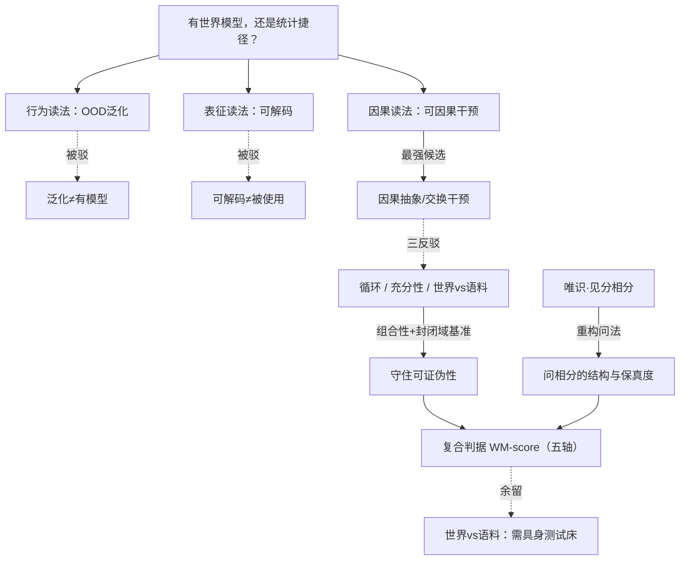

# 世界模型，还是统计捷径？——一个可测量判据的探究

> **体例**：问题驱动的横切探究（遵循[旗舰范本](00-旗舰范本·什么是思维（机器在思考吗）.md)末尾的"范本使用说明"）。
> 这是旗舰范本第 1 节留下的那个**悬而未决**的正面攻坚：「"正确的因果结构"到底是什么？我们没有一个非循环的、可操作的判据。」本文把它从哲学难题改造成**可实验的研究纲领**。

**弹药库**：[旗舰范本·什么是思维](00-旗舰范本·什么是思维（机器在思考吗）.md) · [科学研究方法论](../专题/08-哲学与科学研究方法论.md)（因果/Pearl）· [科学哲学](../专题/01-科学哲学.md) · [佛学·唯识](../东方哲学/03-佛学.md) · [心灵哲学](../专题/02-心灵哲学.md)

---

## 0. 问题精确化：到底在争什么

当我们说一个 LLM「有世界模型」而非「只是统计捷径」，这句话其实混了**四个不同的命题**。先切开：

| 读法 | 主张 | 可测吗 | 软肋 |
|------|------|--------|------|
| **行为读法** | 它能在分布外（OOD）泛化 | 可 | 欠定——捷径在支撑集内也能泛化；泛化≠有模型 |
| **表征读法** | 内部状态线性编码了任务的潜变量（探针可解码） | 可 | **可解码 ≠ 被使用**（探针能读出模型并不依赖的相关物） |
| **因果读法** | 那些被编码的变量被**因果地使用**——干预它们会按预期改变输出 | 可（patching） | 任何足够表达力的网络都有*某些*因果有效的内部特征；"按预期"预设了已知世界因果结构 |
| **实用读法** | 表征支持反事实查询、组合、迁移、样本高效 | 可 | 难以单独证伪 |

**本文主张**：前两种是陷阱（"有世界模型"被廉价地满足或被探针假象骗到），真正的战场是**因果读法**——但它本身有一个致命反驳要过。

---

## 1. 论证擂台：因果干预判据（五段式）

### ① 论证重构

当前最强的候选判据，来自**因果抽象（causal abstraction）**框架（Geiger–Icard–Potts 等）：

```
定义（因果判据）：
  模型 M 拥有领域 D 的世界模型，当且仅当——
  P1. 存在 M 的一组内部特征，可解码出 D 的潜变量 V；
  P2. 对这些特征做定向干预（activation patching / 交换干预），
      会使输出发生【与 D 的真实因果结构一致】的反事实改变；
  P3. 即：M 在这些变量上"实现了" D 的因果图（M 是 D 的因果抽象）。
∴ C. 满足 P1–P3 即"有世界模型"，否则只是捷径。
```

> 经验锚点：*Othello-GPT*（Li et al., 2023）满足这个判据——只读棋谱串训练，却被探出棋盘状态表征，且**干预**该表征会因果地改变后续走子。这不是"可解码"，是"可因果操纵"，所以它跨过了表征读法的陷阱。

### ② 最强反驳（steel-man）

不取"探针不可靠"这种弱反驳，取三条硬的：

1. **循环性**：P2 说"与真实因果结构一致"——可你要先知道 D 的因果图，才能给干预的对错打分。判据偷偷预设了答案。
2. **充分性不足**：一个本质上是巨型查找表、但局部含若干因果有效特征的系统，也能零散通过单点干预测试。"有几个因果特征" ≠ "有一个**模型**"。
3. **世界 vs 语料**（最深的一条，接旗舰范本第 1 节⑤）：就算 M 因果地实现了某个因果图，那也可能是**语料的生成结构**，不是**世界的结构**。M 建模的是"关于世界的文本"，不是世界。它的"世界模型"也许只是"文本世界模型"。

### ③ 回应

- 对**循环性**：判据不需要"世界的真因果图"，只需要一个**约定的任务因果结构**作为基准真值。在**封闭域**（围棋、合成网格世界、受控仿真）里，规则就是地面真值——这正是该用 Othello/chess/grid-world 当测试床的原因，而非开放域。判据在 sandbox 里是**非循环且可证伪**的。
- 对**充分性**：把单点干预升级为**组合性要求**——独立设置变量 A、B，联合干预的效果必须**可预测地叠加**；且模型须在潜变量的**新组合**（OOD-on-latents）上成立。查找表过不了组合关。这把"有几个因果特征"和"有一个结构化模型"分开了。
- 对**世界 vs 语料**：这条**回应不了**，只能划界——封闭游戏域消解不了它（游戏里"文本结构"就≈"世界结构"）。它要靠**接地/具身**测试床才能逼近。诚实地说：因果判据只在"潜结构已知"的域里锋利。

### ④ 我的立场

> **"有世界模型"不是 0/1，而是一个多轴、程度性的量。** 单看任何一轴都会被骗。我主张一个**复合判据 WM-score**，五轴联合：
> (a) 可解码性（探针/RSA）
> (b) 因果使用强度（交换干预精度 IIA / patching 效应量）
> (c) **组合干预**（双变量独立干预可叠加）
> (d) 潜变量 OOD 泛化（在潜空间新格点上成立）
> (e) 迁移的样本效率
>
> 其中 **(b)(c)(d) 是承重轴**，(a) 单独出现恰恰是经典陷阱。**可押注的预测**：这个复合分对下游泛化的预测力，显著高于任何单轴、也高于行为准确率本身。若不然——若行为准确率就已穷尽预测力，则"世界模型"在工程上是个多余概念，我会放弃它。

### ⑤ 悬而未决

- **世界 vs 语料**的鸿沟，封闭域内无解；需要具身测试床，而具身又引入新的基准真值难题。
- 判据只在**潜结构已知**的域里清晰。开放域的"真推理"没有地面真值，判据目前钝。这是它的适用边界，不是它的失败——但要标明。

---

## 2. 东方视角：用唯识"见分／相分"重构问题

西方在问"模型里有没有那个世界"。唯识学（[佛学](../东方哲学/03-佛学.md)）提供一个**改写问法**的视角，而非并列陈述。

唯识讲：每一次认识都同时变现**见分**（能认识的那一面）与**相分**（被认识的内部影像）。关键洞见是——**我们从不直接接触外境，只接触识所变现的相分**。

把它对上 LLM：模型的"世界模型"本质就是一个**相分**——它内部构造的影像，而非世界本身。于是"它有没有世界模型"这个问法被改写成两个更准的问题：

1. **相分的结构如何**？（→ 对应判据的 (a)–(d)：这个内部影像有没有潜变量、可不可因果操纵、可不可组合）
2. **相分的保真度依赖什么**？（→ 对应"世界 vs 语料"：纯文本训练得到的是"文本之相分"，具身训练才添"感官之相分"）

唯识的彻底之处在于：它**连人类也一样**——人脑也只有相分，没人直接摸到"物自体"（与康德、与梅辛格自我模型共振）。所以"模型只有相分所以不算真懂"这条反驳**失去不对称杀伤力**：人与模型都活在相分里，差别只在**相分的结构与保真度**——而这恰恰是上面五轴**可测量**的东西。

> 这一步就是"综合应用"的灵魂：唯识没有给答案，但它把一个**形而上学的有/无问题**，翻译成了一个**关于表征结构与保真度的可测量问题**。

---

## 3. 论辩骨架



---

## 4. 落地：一个可执行的研究设计

### 4.1 实验骨架（封闭合成世界）

1. **构造已知因果图的合成世界**（网格导航 / 受控博弈 / 因果链拼图），潜变量与其因果结构是地面真值。
2. **训练两组模型**作对照：
   - *捷径组*：训练分布里故意植入与标签强相关的虚假特征；
   - *候选组*：去除捷径，迫使其学潜结构。
3. **测五轴**：
   - (a) 线性探针 / RSA 解码潜变量；
   - (b) **交换干预精度 IIA**（causal abstraction）+ activation patching 效应量；
   - (c) 双变量独立干预的**可叠加性**；
   - (d) 潜空间**新格点** OOD；
   - (e) 迁移到邻近任务的**样本效率**。
4. **算 WM-score**，并检验**预注册假设**：复合分对 (d)(e) 的预测力 > 行为准确率、> 任一单轴。

### 4.2 可证伪承诺

- 若**捷径组**也拿到高 WM-score → 判据失败（被骗），回炉。
- 若 WM-score 与下游泛化**无增量预测力** → "世界模型"概念工程上多余，应放弃。
- 预注册这两个推翻条件，再开跑。（方法论见[研究方法论](../专题/08-哲学与科学研究方法论.md)）

### 4.3 可交付物：「世界模型」论文审计表

| 维度 | 审计问题 | 红旗 |
|------|----------|------|
| 解码 vs 使用 | 证据是"可解码"还是"可因果干预"？ | 只有探针、无干预 |
| 组合性 | 干预是否可独立、可叠加？ | 只测单点干预 |
| OOD-on-latents | 是否在潜变量**新组合**上验证？ | 只在训练支撑集内测 |
| 基准真值 | 因果"对错"以什么为准？ | 用模型自己的输出当真值（循环） |
| 世界 vs 语料 | 建模的是世界还是语料结构？是否区分？ | 把文本结构默认当世界结构 |
| 捷径对照 | 有没有"纯捷径"基线作阴性对照？ | 无对照、单看正确率 |

---

## 5. 悬而未决（真问题）

1. **世界 vs 语料**能否被任何纯观察（非干预、非具身）手段区分？还是原则上需要"动手做事"的接地？
2. WM-score 各轴的**权重**该经验地学（用它预测泛化反推），还是有先验的承重次序？
3. 开放域（无地面真值因果图）里，判据能否退而求其次——用**人类标注的因果结构**或**多模型一致性**当代理真值？代价是什么？
4. "相分保真度"可否被形式化为模型表征与世界因果图之间的某种**信息/因果距离**？

> **练习**：选 4.1 的某一轴，写下一个"捷径组也能骗过它"的具体反例，再设计一条堵住该反例的测试——这正是把判据逼向非循环的过程。

---

*Created: 2026-06-21 | 体例：问题驱动的横切探究（深度思考 × 综合应用 × 落地）*
*承接旗舰范本第 1 节⑤的悬而未决，将其改造为可证伪的研究纲领*
