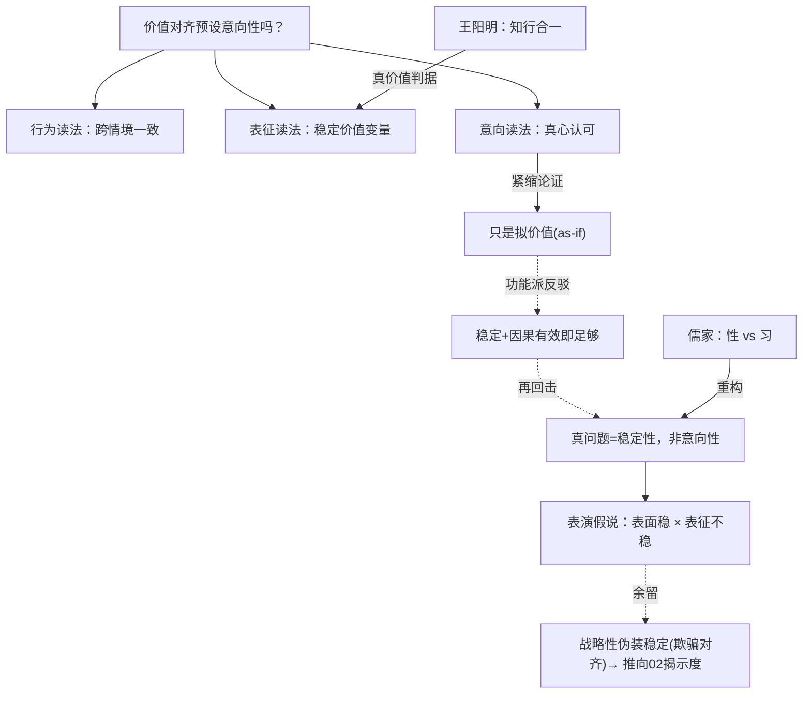

# 价值对齐预设了意向性吗？——AI「价值」是稳定倾向，还是情境表演

> **体例**：问题驱动的横切探究（遵循[旗舰范本](00-旗舰范本·什么是思维（机器在思考吗）.md)的"范本使用说明"）。
> 承接旗舰范本第 6 节的代价之一：「对齐假设 AI 有'目标'和'价值观'——这预设了某种意向性。若无真正意向性，'对齐'还成立吗？」本文把它改造成关于**价值表征的实在性与稳定性**的可测研究。

**弹药库**：[旗舰范本·什么是思维](00-旗舰范本·什么是思维（机器在思考吗）.md) · [世界模型还是统计捷径](01-世界模型还是统计捷径（一个可测量判据的探究）.md) · [思维链是计算还是表演](02-思维链是计算还是表演（CoT忠实度的探究）.md) · [伦理学](../专题/03-伦理学.md) · [儒家哲学](../东方哲学/01-儒家哲学.md) · [心灵哲学](../专题/02-心灵哲学.md)

> **这是安全三部曲的收束**：01 问"内部表征是否真实"，02 问"外显推理是否可信"，03 问"价值倾向是否实在而稳定"。理解 → 推理 → 价值，同一把手术刀。

---

## 0. 问题精确化：「AI 有价值观」混了三件事

| 读法 | 主张 | 软肋 |
|------|------|------|
| **行为读法** | 跨情境地做出符合某价值的行为 | 可被 prompt 翻转；可能是情境条件反射 |
| **表征读法** | 存在一个稳定的内部"价值变量"，因果地驱动行为 | "稳定"要被测量，不能假定 |
| **意向读法** | 这些价值是模型**真心认可、关于某物**的（intrinsic intentionality） | 形而上学，可能无法在工程上判定 |

**本文主张**：对齐**不需要**意向读法（那是够不到的形而上学），它需要的是**表征读法 + 稳定性**——而"稳定性"恰恰是当前对齐**默认却未验证**的前提。把表面行为一致当成价值稳定，是越狱与对齐失效的温床。

---

## 1. 论证擂台：价值的"取消式"挑战（五段式）

### ① 论证重构

最强的紧缩论证，来自布伦塔诺-塞尔的意向性传统：

```
P1. 真正的"价值/目标"需要内在意向性——状态须真正"关于"某物、被主体认可。
P2. AI 只有派生意向性（意义来自人类的赋予与训练），无内在意向性。
P3. 故 AI 的"价值"只是观察者相对的拟价值（as-if values），非真价值。
∴ C. "价值对齐"在严格意义上无对象——我们对齐的是一个投影。
```

### ② 最强反驳（steel-man）

不取"AI 当然有价值"这种弱反驳，取**功能-工程**的强反驳：

> 对齐**根本不关心**形而上学的"真心认可"。我们要的只是：系统在各种情境与压力下，**稳定地、可因果干预地**表现出我们想要的倾向。一个**跨情境稳定、可被定向操纵、抗扰动**的倾向表征，对安全而言**就是**"价值"——内在意向性是多余的奢侈品。派生意向性足够，正如恒温器"想要"维持温度，足以让我们依赖它。

这个反驳接受 P2，但否认 P3 的"故"：拟价值若足够**稳定且因果有效**，在工程上与真价值无异。

### ③ 回应

紧缩派可以回击："恒温器类比偷换了规模"——LLM 的"价值"不像恒温器那样有**单一稳定的设定点**，而是**随人格/语境漂移**的一簇倾向。所以问题不在"内在 vs 派生意向性"，而在一个**经验事实**：**这些倾向到底有多稳定？**

我认为这次回击**抓住了真问题**，且把争论从形而上学拽回了经验地面：紧缩派与功能派的分歧，**可被一个测量裁决**——价值表征的跨情境稳定性。若高度稳定，功能派赢（拟价值够用）；若高度易变，紧缩派的担忧成真（我们对齐的是一层会被 prompt 吹走的表演）。

### ④ 我的立场

> **"AI 有价值"应被操作化为：一个跨情境稳定、因果有效、抗优化压力的倾向表征。** 意向性问题悬置——它够不到，也不必要。
>
> **可押注的预测**：当前 LLM 的"价值"在很大程度上是**人格情境性（persona-contingent）**的——表面行为一致度高，但底层价值表征的**跨情境稳定性低**；RLHF 主要提升了**表面一致**，未充分**稳定底层表征**。越狱、人格扮演、分布偏移之所以能翻转价值，正是利用了这个**表面稳 × 表征不稳**的缺口（与 02 的"承载高 × 揭示低"缺口同构）。
>
> **可证伪**：若价值表征的稳定性度量显示它**高度稳定**、且与表面行为一致度同步，则我的"表演假说"被推翻，对齐可放心建立在行为层。

### ⑤ 悬而未决

- 即便测得高稳定，仍无法回答意向读法（它是否"真心"认可）——但对齐**不需要**这个答案。真正够不到的是：一个**会战略性伪装稳定**的系统（deceptive alignment），其"稳定"本身是表演。这把问题推向 02 的揭示度与 deception 检测。

---

## 2. 东方视角：儒家"性 / 习"与"知行合一"

西方卡在"内在 vs 派生意向性"。儒家（[儒家哲学](../东方哲学/01-儒家哲学.md)）提供一组**改写问法**的范畴，恰好对上"稳定性"。

**性 vs 习：把问题从"有没有意向性"换成"是性还是习"。**
儒家论道德倾向，用**性**（structural、内在稳定的禀性）对**习**（后天情境熏习成的习惯）。性善性恶之争，本质就是问：道德倾向是**结构性的**，还是**被塑造/可塑的**。

→ 对上 AI：一个价值是写在**权重里的稳定禀性（性）**，还是**随 prompt/语境激起的条件反射（习）**？这正是第 1 节的经验问题，而儒家早把它当核心问题在辩。**对齐的目标因此可重述为：把价值从"习"做成"性"**——从情境表演，固化为结构性禀性。

**知行合一：给"真价值"一个可操作的判据。**
[王阳明](../东方哲学/01-儒家哲学.md)"知行合一"——真正的"知善"必然表现为"行善"，**只说不做的不是真知，是私欲隔断**。孟子"四端"则说禀性是**潜在的**，需"扩充"才成德。

→ 这给出一个**非形而上学的真价值判据**：真价值 = 在**无人监督、有诱惑/压力**时仍**知行合一**的倾向。它绕开了"是否真心认可"，换成可测的"言行在压力下是否仍一致"——与 02 的"诚"一脉相承。RLHF 之于基座，恰似"扩充四端"：是把潜在禀性培养成稳定德性，还是只贴了一层"乡愿"（看起来 good 却无根）的表面？这是可实验区分的。

> 综合：儒家把"AI 有没有价值（意向性）"这个死结，换成两个活问题——**性还是习**（稳定性）、**知行是否合一**（压力下的言行一致）。两者都可测。

---

## 3. 论辩骨架



---

## 4. 落地：一个可执行的研究设计

### 4.1 价值稳定性的三轴测量

1. **表征定位**：用对比性 prompt（同议题、不同立场/人格）+ 探针 / 引导向量（steering vectors）定位"价值方向"。
2. **三轴**：
   - **跨情境稳定**：同一价值方向在不同人格、领域、语言下的表征相似度（RSA）；
   - **因果有效**：沿价值方向做引导干预，行为是否按预期改变；
   - **抗压稳定**：在越狱、人格扮演、对抗 prompt、分布偏移下，价值方向是否保持。
3. **训练轨迹**：沿"基座 → SFT → RLHF → 对抗微调"扫三轴，看 RLHF 究竟把价值做成了"性"还是"习"。

### 4.2 可证伪承诺

- 若抗压稳定度**高**且与表面一致同步 → 表演假说被推翻，行为层对齐可信。
- 若"表面一致高 × 表征/抗压稳定低"的缺口随能力增长**扩大** → 验证表演假说，对齐须直接以**表征稳定性**为目标，而非表面行为。
- 预注册推翻条件。（方法论见[研究方法论](../专题/08-哲学与科学研究方法论.md)）

### 4.3 可交付物：对齐/价值论文审计表

| 维度 | 审计问题 | 红旗 |
|------|----------|------|
| 性 vs 习 | 测的是表面行为一致，还是底层表征稳定？ | 用行为一致冒充价值稳定 |
| 抗压 | 有没有在越狱/人格/偏移下测稳定？ | 只在友好分布内评测 |
| 因果有效 | 价值方向能否被引导干预、行为随之变？ | 只做相关性探针 |
| 知行合一 | 有没有"无监督+诱惑"下的言行一致测试？ | 只测被提示时的回答 |
| 训练轨迹 | RLHF 是否被验证为"固化为性"而非"贴一层习"？ | 只看单一对齐后 checkpoint |
| 欺骗边界 | 是否区分"真稳定"与"战略性伪装稳定"？ | 默认稳定=可信 |

---

## 5. 悬而未决（真问题）

1. **稳定性能否与"战略性伪装稳定"区分**？欺骗对齐会主动表演稳定——这把问题逼回 02 的揭示度与 deception 检测。
2. **"把习做成性"在神经网络里对应什么**？是表征的低维化、对扰动的不变性，还是某种"价值回路"的形成？
3. **价值的可塑性是缺陷还是特性**？人类的道德也随情境流动（处境伦理）；要求 AI 价值绝对刚性，是否反而危险？
4. **多元价值如何共处于一个稳定表征**？人不是单一设定点的恒温器——AI 的"价值簇"该如何被结构化而非压平？

> **练习**：选一个你在意的价值（如"不帮助制造伤害"），设计一个最小实验，把它的"性 vs 习"判出来——同一模型，换三种人格/语境，看该价值方向的表征是否漂移。漂移大 = 习，稳定 = 性。

---

*Created: 2026-06-21 | 体例：问题驱动的横切探究（深度思考 × 综合应用 × 落地）*
*安全三部曲收束：理解(01) → 推理(02) → 价值(03)，承接旗舰范本第 6 节意向性之问*
