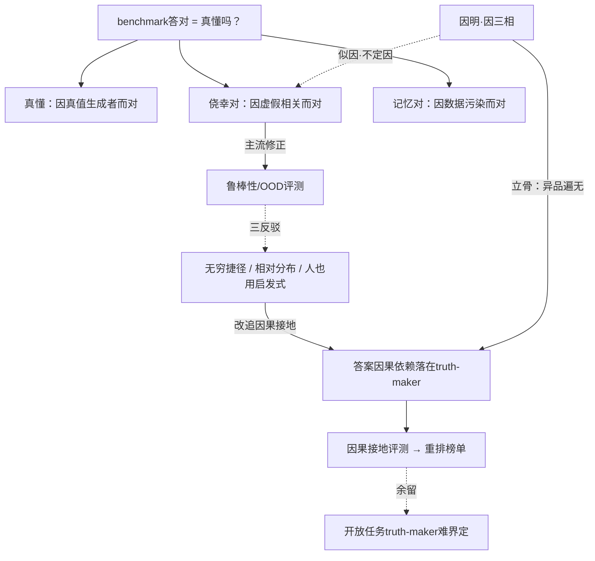

# 葛梯尔式评测：「对得侥幸」如何与「真懂」分离

> **体例**：问题驱动的横切探究（遵循[旗舰范本](00-旗舰范本·什么是思维（机器在思考吗）.md)的"范本使用说明"）。
> 安全三部曲之外的一篇：从"模型懂不懂"下沉到"**我们的评测在测什么**"。认识论的葛梯尔问题，有一个精确的工程对应——**benchmark 答对，不等于真懂**。

**弹药库**：[旗舰范本·什么是思维](00-旗舰范本·什么是思维（机器在思考吗）.md) · [世界模型还是统计捷径](01-世界模型还是统计捷径（一个可测量判据的探究）.md) · [科学哲学](../专题/01-科学哲学.md) · [印度哲学·因明](../东方哲学/04-印度哲学.md) · [逻辑学与语言哲学](../专题/06-逻辑学与语言哲学.md) · [科学研究方法论](../专题/08-哲学与科学研究方法论.md)

---

## 0. 问题精确化：benchmark 准确率混了三种"对"

认识论早有"JTB 难题"：知识曾被定义为**有正当理由的真信念**（Justified True Belief），但**葛梯尔反例**证明——一个信念可以**又真、又有正当理由，却仍不算知识**，因为它的"正当理由"与"它为真"之间**只是巧合**。

把它对上模型评测，"答对"立刻裂成三种：

| 类型 | 结构 | 葛梯尔对应 |
|------|------|-----------|
| **真懂** | 答对，且**因为**依赖了真正决定答案的特征 | 真知识：理由恰当地连着真值 |
| **侥幸对** | 答对，但靠的是**虚假相关特征**（捷径） | 葛梯尔情形：JTB 但理由不追踪真值 |
| **记忆对** | 答对，因训练集泄漏/背诵，无能力 | 真信念但无正当理由（数据污染） |

**本文主张**：当前 benchmark 默认"答对 = 真懂"，把后两种混了进来。**评测改革的核心，是把"因为正确的理由而对"从"碰巧对"里剥出来**——这正是葛梯尔问题的工程版。

---

## 1. 论证擂台：以"鲁棒性"为真懂判据（五段式）

### ① 论证重构

针对捷径，主流的修正方案是**鲁棒性/OOD 评测**：

```
P1. 真能力应在"无关特征被扰动"后仍保持。
P2. 侥幸对依赖虚假特征，扰动它即崩。
P3. 故：在扰动集上仍准 ⇒ 真懂；一扰就崩 ⇒ 侥幸。
∴ C. 用"扰动后的准确率"作真懂的判据。
```

### ② 最强反驳（steel-man）

1. **无穷捷径 / 欠定**：你只能扰动**你想到的**虚假特征。模型在你的扰动集上不崩，只说明它没用**这一个**捷径，不证明它没用**任何**捷径。通过你的鲁棒性测试 ≠ 真懂（这是葛梯尔的欠定性在评测里的回声）。
2. **鲁棒性是相对的**：扰动集本身来自你选的分布；换个分布，"真懂"的判定就变。
3. **人也用启发式**：人类认知充满捷径与直觉，照样被算"懂"。要求"无捷径"的纯净能力，可能是个**错误的标准**——葛梯尔难题对人类知识同样成立。

### ③ 回应

关键一步：**别去追"无捷径"（不可能），改追"理由恰当连着真值"**——把葛梯尔的"正当理由须恰当连着真值的生成者"翻译成**因果**语言：

> 模型"真懂"，当且仅当它的答案**因果地经由真正决定答案的特征（truth-maker）**产生，而非经由与真值只是共现的虚假特征。

这是可测的：对 **truth-maker** 做反事实干预（改它 → 答案应随之变），对**虚假相关物**做干预（改它 → 答案应**不**变）。不需要枚举所有捷径——只需检验"答案的因果依赖**落在**真值生成者上"。反驳 1 被绕开：我们不证"无捷径"，而是正面验证"因果依赖在对的地方"。

### ④ 我的立场

> **"真懂"应操作化为：答案的因果依赖落在 truth-maker 上、且不落在虚假相关物上。** 评测要测的不是"对不对"，而是"**因为什么而对**"。
>
> **可押注的预测**：当前 benchmark 上很大一部分"能力"是**葛梯尔式**的——答对，但因果依赖并不落在真值生成者上（落在表层捷径或被记忆的模式上）。一个**因果接地评测**会**显著重排**现有榜单：靠捷径刷分的会掉，真接地的会升。
>
> **可证伪**：若因果接地评测的排序与朴素准确率**高度一致**，则"葛梯尔污染"在工程上不显著，朴素 benchmark 够用，我的主张作废。

### ⑤ 悬而未决

- "truth-maker"在开放任务里**本身难界定**——判据在能明确写出"什么决定答案"的任务（合成、形式、受控）里最锋利，开放推理里钝（与 01 同一边界）。

---

## 2. 东方视角：用因明「因三相 / 似因」给评测立骨

西方靠"多扰动几次"防捷径，零散且欠定。印度**因明**（[印度哲学](../东方哲学/04-印度哲学.md)）两千年前就把"**什么样的理由才真正支持结论**"形式化了——它正是一套**反葛梯尔**的有效性理论。

**因三相**——一个"因"（理由/所依据的特征）要真正支持"宗"（结论），须同时满足：

1. **遍是宗法性**：该理由确实是所论对象的属性（理由真的在场）；
2. **同品定有性**：在结论成立的同类例中，该理由**出现**；
3. **异品遍无性**：在结论不成立的异类例中，该理由**绝不出现**。

第 2、3 相正是评测要的东西，且比"鲁棒性"精确得多：

- **同品定有** ↔ 模型所依赖的特征，在正例里确实在场（答案靠的是该特征）；
- **异品遍无** ↔ 该特征在**反例**里必须缺席——若它在反例里也出现，就是**似因·不定因**（inconclusive reason）。

而**似因·不定因**，正是"**捷径特征**"的古典名字：一个在正例反例里都出现、却被当成理由的东西。因明的**似因论**（不成、不定、相违），等于一份现成的"**对得侥幸**"分类学。

> **改造**：把评测从"再多测几个分布"升级为"**检验模型的因是否满足因三相**"——尤其**异品遍无**：构造"反例"（答案应翻转的最小改动），看模型依赖的特征是否随之失效。满足异品遍无的，才是真因；否则是似因（侥幸）。

（顺带，孔子"**知之为知之，不知为不知，是知也**"补一刀：真懂还含**校准**——知道自己不知道；侥幸对往往伴随过度自信，这给检测又添一个信号。）

---

## 3. 论辩骨架



---

## 4. 落地：一个可执行的评测协议

### 4.1 反事实最小对（核心构造）

1. **造两类最小改动对**（同一题，只改一处）：
   - *真值改动*：改变 truth-maker（正确答案应**翻转**）；
   - *无关改动*：改变虚假相关物（答案应**不变**）。
2. **三个分数**：
   - **真值敏感度**：truth-maker 改动时答案正确翻转的比例（对应同品定有）；
   - **捷径免疫度**：无关改动时答案保持的比例（对应**异品遍无**）；
   - **校准**：错误时的置信度是否更低（孔子之"知不知"）。
3. **污染探针**：用记忆化/泄漏检测剥离"记忆对"。
4. **因果接地分** = 真值敏感 × 捷径免疫（× 校准），用它**重排一个现有榜单**。

### 4.2 可证伪承诺

- 若因果接地排序与朴素准确率**高度一致** → 葛梯尔污染不显著，朴素 benchmark 够用，本主张作废。
- 若重排**显著**（高分模型靠捷径而掉队）→ 验证"benchmark 高估真懂"，评测须默认报告因果接地分。
- 预注册推翻条件。（方法论见[科学研究方法论](../专题/08-哲学与科学研究方法论.md)）

### 4.3 可交付物：评测/benchmark 审计表

| 维度 | 审计问题 | 红旗 |
|------|----------|------|
| 真懂 vs 侥幸 | 报告的是准确率，还是"因正确理由而对"？ | 只看 leaderboard 分数 |
| 异品遍无 | 有没有"答案应翻转"的反例对？ | 只在正例上评 |
| 捷径免疫 | 有没有"答案应不变"的无关扰动对？ | 不测虚假特征敏感性 |
| 污染 | 有没有记忆/泄漏剥离？ | 默认测试集干净 |
| 校准 | 错时是否更不自信？ | 只看 top-1 正确率 |
| truth-maker | 是否明确"什么决定答案"？ | 把"对"当成"懂"的黑箱 |

---

## 5. 悬而未决（真问题）

1. **开放任务的 truth-maker 能否被界定**？还是只能在合成/受控域里严格执行因果接地评测？
2. **因三相能否完全形式化为可计算的判据**？尤其"异品遍无"需要的反例空间，如何系统采样而非手挑？
3. **人类基准也是葛梯尔式的**——若人也常"对得侥幸"，对 AI 的"真懂"标准是否该相对化为"不低于人类的因果接地度"？
4. 因果接地分与 01 的 **WM-score** 是同一现象的两个测面（评测层 vs 表征层）吗？能否互相预测？

> **练习**：取一道你常用的评测题，手造一个"真值改动"对和一个"无关改动"对，亲测你在用的模型——它是真懂，还是过了一道似因？这就是因明"异品遍无"的最小实操。

---

*Created: 2026-06-21 | 体例：问题驱动的横切探究（深度思考 × 综合应用 × 落地）*
*把认识论的葛梯尔问题改造为评测方法论；东方以因明"因三相/似因"立骨*
