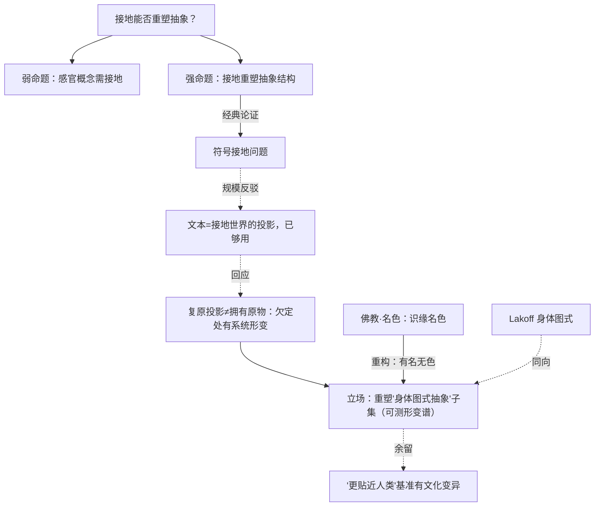

# 接地能否重塑抽象？——纯文本模型缺了什么

> **体例**：问题驱动的横切探究（遵循[旗舰范本](00-旗舰范本·什么是思维（机器在思考吗）.md)的"范本使用说明"）。
> 旗舰范本第 2 节（维特根斯坦·生活形式）与第 6 节（"缺接地的深度"）反复点到"接地"，却从未独立深挖。本文正面攻它，并把一个看似软的哲学直觉，逼成可测的表征几何问题。

**弹药库**：[旗舰范本·什么是思维](00-旗舰范本·什么是思维（机器在思考吗）.md) · [世界模型还是统计捷径](01-世界模型还是统计捷径（一个可测量判据的探究）.md) · [心灵哲学·具身认知](../专题/02-心灵哲学.md) · [佛学·名色](../东方哲学/03-佛学.md) · [逻辑学与语言哲学](../专题/06-逻辑学与语言哲学.md)

---

## 0. 问题精确化：「接地很重要」其实有三个强度

| 命题 | 内容 | 争议度 |
|------|------|--------|
| **弱** | 纯感官概念（红、疼、咸）需要接地才能真正掌握 | 低，近乎显然 |
| **强** | 接地会**重塑连抽象概念**（因果、数量、否定、时间）的结构 | 高，本文焦点 |
| **混淆项** | 接地改变的是**能力分数**，还是**内部表征**？ | 常被混为一谈 |

**本文主张**：真正值得研究的是**强命题**——接地不只是"给模型多接一个模态"，而是**重塑了一部分抽象概念的表征几何**。具体说：那些**靠身体图式（image schema）搭起来的抽象概念**（多/少=上/下、时间=空间、因果=力），在有接地与无接地的模型里，结构会**系统性地不同**——哪怕两者任务分数相同。

---

## 1. 论证擂台：符号接地问题（五段式）

### ① 论证重构

经典的强接地论证（Harnad 1990 符号接地问题 + 具身认知）：

```
P1. 符号的意义不能只靠"符号间的相互定义"确立（否则是循环：查词典查到天荒地老）。
P2. 意义最终须"接地"到非符号的感觉运动经验。
P3. 纯文本模型只有符号间关系，无感觉运动接地。
∴ C. 纯文本模型的"概念"悬空——缺了意义的地基。
```

### ② 最强反驳（steel-man）

不取弱反驳，取**分布语义 + 规模**的强反驳：

> "符号旋转木马"被经验事实驳倒了。语言是被接地经验**投影**出来的——文本共现里**已经编码**了世界的结构。纯文本模型从文本中习得了颜色的相似关系、物理常识、空间推理，甚至能复原"接地"概念的大量结构。所以接地是**便利**，不是**必需**；P1 的"循环"假象，恰被规模打破——足够大的符号网络从投影里重建了地基。

这个反驳接受 P3，但否认 C：投影若信息足够，悬空的符号也能自我支撑。

### ③ 回应

关键区分：**复原投影 ≠ 拥有原物**。文本是接地世界的**影子**——影子保留了大量结构（所以纯文本模型很强），但在**语言对经验欠定**的地方有**系统性形变**：

- 语言很少明说"红比粉更接近橙"这类**连续感官拓扑**，模型只能从稀疏文本里猜；
- 身体图式（重/轻、容器内外、推拉之力）在语言里多以**隐喻**残留，未被显式陈述。

所以"接地是否必需"问错了。**对的问题是：当 色（感官）被抽掉，哪些 名（概念）的结构会变形、变形多大？** 这把不可证的"必需性"换成了可测的"形变谱"。

### ④ 我的立场

> **接地不是加一个模态，而是重塑一个可测子集的抽象概念——即那些隐喻地搭在身体图式上的概念**（Lakoff–Johnson：抽象概念由身体意象图式隐喻地建构）。
>
> **可押注的预测**：把概念排成一条谱——纯感官（红/疼）→ 身体图式抽象（多少、内外、因果=力）→ 纯形式（素数、否定、递归）。有接地的模型，与无接地的模型相比，在**中段（身体图式抽象）**的表征几何**差异最大、且更贴近人类**；两端差异小（纯形式两者都靠形式结构，纯感官无接地者本就缺）。**即便任务分数相同，表征几何不同。**
>
> **可证伪**：若 RSA 显示接地与否在中段**无系统差异**，或差异不向"更贴近人类"的方向，则强命题被推翻，接地只是"多一个模态"。

### ⑤ 悬而未决

- "更贴近人类"以人类行为/神经表征为基准，而人类基准本身有文化变异——基准的选择会影响结论。

---

## 2. 东方视角：佛教「名色」——有名而无色

西方用"符号 vs 感觉运动"。佛教（[佛学](../东方哲学/03-佛学.md)）的**名色（nāma-rūpa）**给出一个更深的**缘起**框架，直接改写问法。

十二因缘里，**名**（受想行识等心理/概念面）与**色**（物质/感官面）是**相互依存、不可单立**的一对：经里说"**识缘名色，名色缘识**"——认识、概念、感官三者互为条件，谁也不能脱开谁独自成立。

把它对上模型：**纯文本模型，是"有名而无色"**——它拥有 名（概念间的关系网），却被切断了与之缘起共生的 色（感官形）。名色论的洞见因此变成一个**结构预言**：

> 名一旦脱离与它缘起共生的色，并非整体失效，而是**那些与色交织最深的名，结构最受损**；与色关系浅的名（纯形式），受损最小。

这与西方的 Lakoff 图式谱**惊人同向**：越是"色"性强（身体感官）的概念，离了色变形越大；越"名"性纯（形式逻辑）的，越能自立。两套两千年和四十年的理论，给出了**同一条可测的形变谱**——这正是"综合应用"最有力的时刻：东西方在一个**可实验的预测**上交汇。

（中国**名家**"白马非马"的名实之辩可作旁注：名一旦从实抽离，便生出脱离指称的吊诡——纯文本模型的"白马"，正是一个无"实/色"锚定的名。）

---

## 3. 论辩骨架



---

## 4. 落地：一个可执行的研究设计

### 4.1 概念形变谱实验

1. **造一条概念谱**（每段若干概念）：纯感官（红/疼/咸）→ 身体图式抽象（多少、内外、上下、因果=力、时间=空间）→ 纯形式（素数、否定、递归、相等）。
2. **对照模型**：纯文本 vs 视觉-语言 vs 具身（控制规模/数据量尽量匹配）。
3. **测表征几何**：
   - **RSA**：各模型概念表征的相似度结构，与**人类行为/神经基准**对齐度；
   - **探针 + 干预**：身体图式结构（如"容器"的内外拓扑）是否被表征且因果有效；
   - **任务-表征分离**：在任务分数**配平**后，比较表征几何——证明差异不只是能力差。
4. **检验预言**：接地增益是否在**中段（身体图式抽象）最大**、两端最小，且朝"更贴近人类"方向。

### 4.2 可证伪承诺

- 若中段**无系统差异**或差异不朝人类方向 → 强命题被推翻，接地=仅多一模态。
- 若差异集中在中段且贴近人类 → 验证"接地重塑身体图式抽象"，多模态评测须按概念谱**分段报告**。
- 预注册推翻条件。（方法论见[研究方法论](../专题/08-哲学与科学研究方法论.md)）

### 4.3 可交付物：接地/多模态论文审计表

| 维度 | 审计问题 | 红旗 |
|------|----------|------|
| 强弱不混 | 测的是感官概念，还是**抽象**概念的重塑？ | 用红/疼的提升冒充"理解更深" |
| 能力 vs 表征 | 任务分数配平后，表征几何是否仍异？ | 只比 benchmark 分 |
| 概念谱 | 有没有按"感官→图式→形式"分段？ | 单一总分掩盖分段差异 |
| 人类基准 | 与人类行为/神经表征对齐如何测？ | 无外部基准，自说自话 |
| 因果 | 身体图式结构是否被**因果**使用？ | 只做可解码探针 |
| 名色边界 | 是否承认"纯形式段"接地增益应最小？ | 笼统宣称"接地全面更好" |

---

## 5. 悬而未决（真问题）

1. **文本投影的上限在哪**？纯文本能复原多少身体图式结构——是渐近逼近，还是有一道天花板？
2. **哪种接地才算数**？视觉接地 vs 真正的感觉**运动**接地（能推能拉），对身体图式概念的重塑是否本质不同？
3. **名色可分性**：是否存在一类"纯名"概念（数学/逻辑）真的不需要任何色？还是连数学直觉也偷偷扎根于空间/操作（具身数学认知）？
4. 形变谱与 01 的 **WM-score**、04 的**因果接地分**能否打通——接地是否正是"把语料模型推向世界模型"的那条路（接旗舰范本第 1 节⑤的"世界 vs 语料"）？

> **练习**：选三个概念，各属"感官 / 身体图式 / 纯形式"一段，设计一个最小 RSA 对照，预测纯文本模型在哪一段离人类最远——再去验证。这就是"名色形变谱"的最小实操。

---

*Created: 2026-06-21 | 体例：问题驱动的横切探究（深度思考 × 综合应用 × 落地）*
*把"接地必需性"改造为可测的"概念形变谱"；东方以佛教"名色"缘起立骨，与 Lakoff 身体图式同向*
