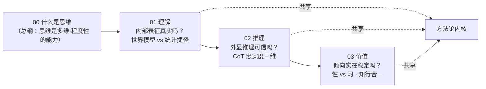

# 探究层 · 导读

> **一句话**：`专题/` 是弹药库（陈述"有哪些观点"），`探究/` 是把弹药打出去——**亲自把一个真问题想到底，并落到可做的研究上**。
> 本层每篇都遵循[旗舰范本](00-旗舰范本·什么是思维（机器在思考吗）.md)末尾的"范本使用说明"。

---

## 一、本层是什么

不是又一份哲学综述，而是一组**问题驱动的横切探究**。判断标准只有一条：

> 读完后，你不只是"多知道了几个观点"，而是"被卷入了一场仍在进行、且能动手推进的思考"。

每篇强制三件事——**深度思考**（五段式：重构 → 最强反驳 → 回应 → 我的立场 → 悬而未决）、**综合应用**（让东方思想*重构*西方问题，而非并列）、**落地**（产出可证伪的实验设计 + 可挂工位的审计表）。

---

## 二、目录与主线

| # | 文档 | 在主线中的位置 | 落地领域 |
|---|------|----------------|----------|
| **00** | [什么是思维（机器在思考吗）](00-旗舰范本·什么是思维（机器在思考吗）.md) | **总纲 · 范本** | 心灵哲学 × AI |
| **01** | [世界模型还是统计捷径](01-世界模型还是统计捷径（一个可测量判据的探究）.md) | **①理解**：内部表征是否真实 | 可解释性 |
| **02** | [思维链是计算还是表演](02-思维链是计算还是表演（CoT忠实度的探究）.md) | **②推理**：外显推理是否可信 | AI 安全 · 监控 |
| **03** | [价值对齐预设了意向性吗](03-价值对齐预设了意向性吗（AI价值的实在与稳定）.md) | **③价值**：倾向是否实在稳定 | AI 对齐 |
| **04** | [葛梯尔式评测](04-葛梯尔式评测（对得侥幸如何与真懂分离）.md) | **元层**：评测在测什么（"真懂"vs"侥幸对"） | 评测方法论 |
| **05** | [接地能否重塑抽象](05-接地能否重塑抽象（纯文本模型缺了什么）.md) | **地基**：纯文本缺了什么（概念形变谱） | 多模态 · 具身 |

01–03 构成一条自洽的**安全研究主线**，04 退一步审问"我们的评测本身"：

> 一句话串起来：**先问它懂不懂（01 内部表征），再问它说的算不算数（02 外显推理），最后问它的倾向靠不靠得住（03 价值稳定）。**

---

## 三、四篇共享的方法论内核

每一篇其实在重复同一套"把哲学问题变成研究问题"的招式——这套招式本身，比任何单篇结论更值得带走：

1. **拆维度**：把一个含混的大词（理解 / 忠实 / 价值）切成 3–4 个**可分别测量**的读法，指出哪个是真战场、哪些是陷阱。
2. **因果干预判据**：候选判据一律升级到"**可因果操纵**"层次（probing → activation patching / 交换干预 / 引导向量），堵住"可解码≠被使用""一致≠揭示""表面稳≠表征稳"这类同构陷阱。
3. **东方重构**：引一个东方视角去**改写问法**，而非装点——
   - 01 唯识"见分/相分"→ 问"相分的结构与保真度"；
   - 02 道禅"誊本不可得" + 儒家"诚"→ 把忠实落为可考核的对齐；
   - 03 儒家"性/习" + 王阳明"知行合一"→ 把意向性换成可测的稳定性。
4. **可证伪承诺**：给出会推翻自己立场的具体条件，**预注册**后再开跑（方法论见[科学研究方法论](../专题/08-哲学与科学研究方法论.md)）。
5. **审计表**：把哲学压成一张"读论文/查自己模型"时能直接用的清单。

> **反复出现的同构缺口**：01 的"可解码 × 不被使用"、02 的"承载高 × 揭示低"、03 的"表面稳 × 表征不稳"——三者是同一个结构：**外部表现** 与 **内部实在** 的分离。安全风险大多藏在这条缝里。这本身就是一个值得单独研究的元假说。

---

## 四、待写（候选下一篇）

按本层标准，下列问题已成熟、可直接动手：

- **归纳的可投射性**：哪种架构先验对应古德曼 grue 式的"可投射"假设（休谟 · 科学哲学）。
- **AI 道德地位的决策**：无意识检测器时，道德不确定性下的理性行动（伦理学 · 决策论）。

## 五、从探究到提案

探究可进一步扩写为**可投递的研究提案**（背景 → 假设 → 相关工作 → 方法 → 里程碑 → 算力 → 可证伪标准）。已完成：

- [研究提案/01-CoT忠实度的危险区间](../研究提案/01-CoT忠实度的危险区间（研究提案）.md) ← 由探究 02 扩写

---

## 五、怎么用

- **当读物**：顺着 00 → 01 → 02 → 03 读，是一条从哲学到研究议程的完整路径。
- **当模板**：要开新题，照搬第三节那五步招式（亦即范本的"范本使用说明"）。
- **当工具**：每篇第 4 节的审计表，可直接用于评审 AI 论文或自查模型。

*Updated: 2026-06-21 · 体例：问题驱动的横切探究（深度思考 × 综合应用 × 落地）*
